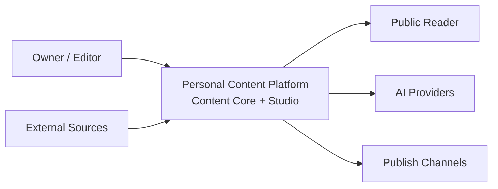
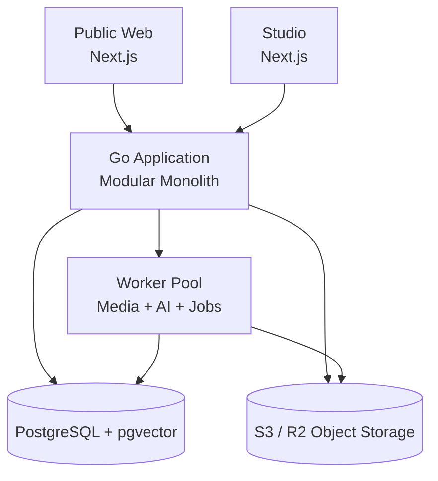
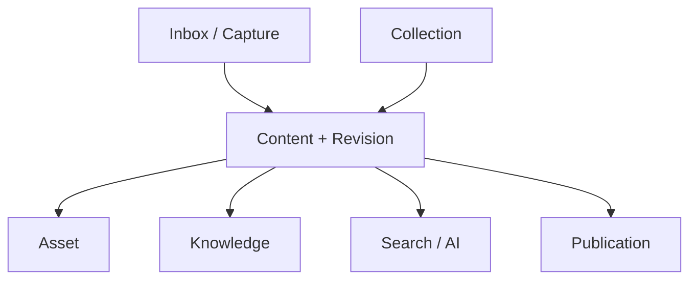
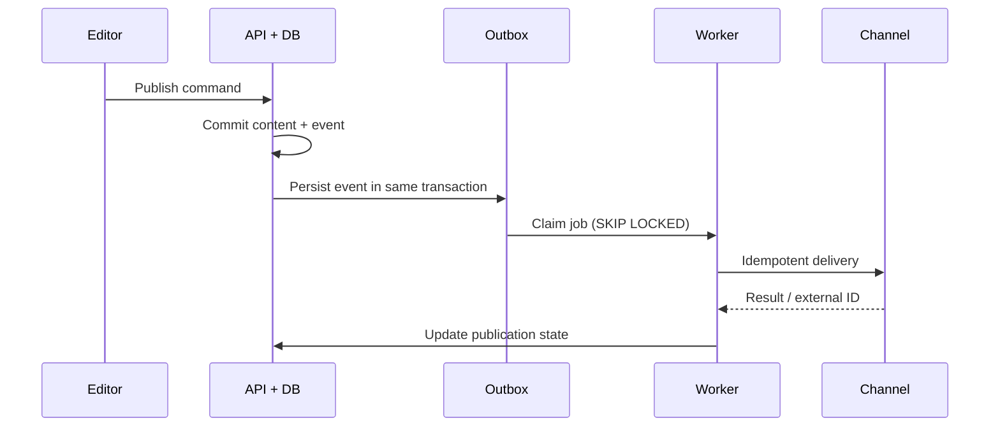
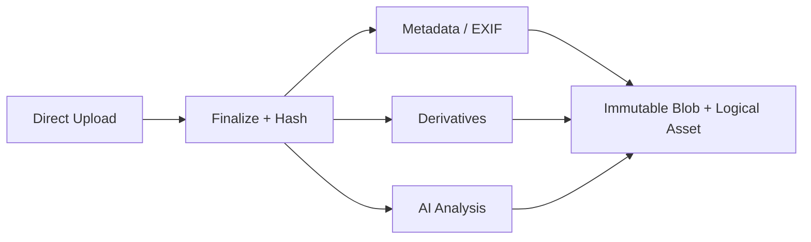

# 个人内容平台项目架构设计文档

> **系统定义**：一个围绕 Capture → Organize → Create → Connect → Publish → Discover → Reuse 构建的长期个人内容中枢；不是传统博客，也不是以页面发布为中心的普通 CMS。

**版本**：1.1  
**状态**：Baseline / 可进入实施设计  
**技术定位**：Personal Content Platform / Product Architecture & Technical Design

## 文档说明

本文档同时承担产品架构、软件架构与实施基线三种职责。它给出系统边界、核心领域、数据模型、接口契约、异步流程、部署方式和演进路径。开发阶段允许对字段和实现细节做增量修订，但任何跨模块边界、内容可迁移性、修订不可变性、发布解耦和 AI 可追溯性相关的改动，必须先形成架构决策记录（ADR）。

### 读者与使用方式

| **读者**    | **重点章节** | **预期产出**                       |
|-------------|--------------|------------------------------------|
| 产品 / 设计 | 1–4、8、17   | 页面原型、工作流和验收标准         |
| 后端开发    | 5–14、16、18 | 模块、数据库、API、Worker 与测试   |
| 前端开发    | 4、8、11、15 | Studio / Public Web 接口与状态处理 |
| 运维 / 安全 | 14、16、19   | 部署、监控、备份、权限与应急       |
| AI 工程     | 10、13       | 检索、处理流水线、模型适配与评测   |

## 目录

1\. 执行摘要

2\. 产品定位、目标与边界

3\. 核心原则与质量属性

4\. 产品信息架构与关键工作流

5\. 总体系统架构

6\. 模块化单体与代码组织

7\. 核心领域模型

8\. Studio 与 Public Web 架构

9\. 内容与编辑器模型

10\. 搜索与个人知识网络

11\. API 与集成契约

12\. 事件、任务与一致性

13\. AI 基础设施

14\. 资产与媒体处理

15\. 身份、权限与安全

16\. 数据、缓存与性能

17\. 发布与分发

18\. 测试与工程质量

19\. 部署、可观测性与灾备

20\. 实施路线图

21\. 架构决策记录

22\. 风险、开放问题与验收基线

附录 A–D

## 1. 执行摘要

该平台以“内容资产在时间中持续增值”为首要目标。所有文章、笔记、项目、摄影、视频、Prompt、书签与页面都进入统一 Content Core；图片、视频、音频和文档作为一等 Asset 管理；Collection 负责策展式组织；Entity 与 Relation 构成个人知识网络；Revision 保留完整演进历史；Publication 将内容本体与网站、RSS、Newsletter、社交平台等分发渠道分离。



*图 1：系统上下文——创作、沉淀、连接与分发统一进入 Content Core。*

### 1.1 架构结论

| **决策** | **结论**                                    | **原因**                                                    |
|----------|---------------------------------------------|-------------------------------------------------------------|
| 部署形态 | 模块化单体 + 独立 Worker                    | 保留清晰领域边界，同时避免个人系统承担微服务运维成本        |
| 后端     | Go 单仓应用                                 | 适合 API、任务执行、媒体编排与长期维护                      |
| 数据     | PostgreSQL + pgvector                       | 关系、全文、向量、JSONB、事务与任务队列统一且足够强         |
| 内容格式 | 版本化结构化 JSON                           | 支持富媒体、Block 编辑和稳定迁移；Markdown 仅作为互操作格式 |
| 媒体     | 对象存储 + CDN                              | 原始文件不可变，派生版本可重建                              |
| 异步     | Transactional Outbox + PostgreSQL Job Queue | 保证事件不丢、任务可重试、无需先引入 Kafka/Redis            |
| AI       | Provider Abstraction + Provenance           | 供应商可替换，任何产物可追溯、可重跑、可人工确认            |
| 前端     | Public Web 与 Studio 两个 Next.js 应用      | 读者体验与创作体验目标不同，发布与演进独立                  |
| 国际化   | zh-CN / en 双语内容变体 + 显式语言路由      | 界面、内容、SEO、检索和发布均以 locale 为边界               |

> **核心判断**：本设计不是“先做普通博客以后再升级”。从第一天就建立长期正确的内容、修订、资产、关系和发布边界；实施顺序采用垂直切片，但领域地基一次设计正确。

## 2. 产品定位、目标与边界

### 2.1 产品使命

帮助个人持续捕获信息、形成内容、建立联系、跨渠道发布，并在未来重新发现与复用，而不是把写作结果沉入按时间排序的文章列表。

### 2.2 成功目标

- 资产长期可迁移：所有核心内容、元数据、关系、修订和媒体均可完整导出。

- 创作体验完整：快速捕获、结构化编辑、自动保存、版本回退、跨内容复用。

- 内容连接能力强：关键词、结构化过滤、语义检索、实体和关系共同工作。

- 发布可靠：网站、RSS 及外部渠道有独立状态、重试记录和可审计结果。

- AI 原生但不依赖单一模型：AI 是内容处理基础设施，不是孤立聊天按钮。

- 单机即可稳定运行，并能通过拆 Worker、读副本和独立搜索服务逐步扩展。

### 2.3 明确非目标

| **非目标**           | **说明**                                                   |
|----------------------|------------------------------------------------------------|
| 通用企业 CMS         | 不优先处理复杂组织审批、上百角色和多品牌代理商流程         |
| 社交社区             | 不设计关注流、私信、开放注册和大规模用户生成内容           |
| 实时多人协同编辑     | 第一阶段不引入 CRDT；保留未来协作接口边界                  |
| 视频转码平台         | 支持个人内容规模的派生处理，不承担海量直播或长视频平台能力 |
| 无代码建站器         | 主题和页面可配置，但不追求任意拖拽页面生成                 |
| 以 AI 自动发布为默认 | 高影响修改和公开发布默认需要人工确认                       |

### 2.4 规模假设

| **维度**  | **设计基线**                 | **扩展触发点**                       |
|-----------|------------------------------|--------------------------------------|
| Workspace | 1–10                         | 需要跨组织计费或强隔离时独立服务     |
| Content   | ≤ 100 万条                   | FTS 延迟或索引体积成为瓶颈时拆搜索   |
| Asset     | ≤ 10 TB 对象数据             | 媒体队列或 CDN 成本需要独立治理      |
| 并发创作  | ≤ 20 活跃会话                | 实时协作出现明确需求时引入 CRDT      |
| 公开流量  | 常态 100 RPS，峰值 1,000 RPS | 前台缓存/CDN 命中不足时拆读模型      |
| 异步任务  | 日均 ≤ 10 万                 | 队列吞吐或隔离需求出现时迁移专用队列 |

## 3. 核心原则与质量属性

### 3.1 架构原则

1. 内容本体与展示、发布渠道彻底解耦。

1. 领域模块拥有自己的写模型；禁止跨模块直接修改数据。

1. Revision 不可变，CurrentRevision 只是指针。

1. 原始媒体不可变；派生文件按处理配方可重建。

1. 任何跨进程副作用通过 Outbox/Job 执行，并具备幂等键。

1. AI 建议与事实分离；未经确认的 AI 结果不得悄悄覆盖人工数据。

1. Workspace 边界进入所有业务主键和查询条件，默认拒绝越界访问。

1. 先以模块化单体交付；只有可量化瓶颈出现后才物理拆分。

### 3.2 质量属性与目标

| **属性** | **目标**                                              | **验证方法**         |
|----------|-------------------------------------------------------|----------------------|
| 可用性   | 核心 API 月可用性 99.9%                               | 探针、SLO 与错误预算 |
| 交互性能 | Studio 普通读取 P95 \< 300ms；写入 P95 \< 500ms       | 分层指标与压测       |
| 搜索性能 | 混合检索 P95 \< 800ms（10 万内容规模）                | 固定语料回归         |
| 可靠发布 | 已接受发布任务不静默丢失；至少一次执行                | Outbox 故障注入      |
| 恢复能力 | RPO ≤ 24h，RTO ≤ 4h；升级目标 RPO ≤ 5min              | 季度恢复演练         |
| 可迁移性 | 可导出原始资产、结构化内容、Markdown/HTML、关系与清单 | 导出后重建演练       |
| 安全     | 私有内容不经公共缓存泄露；所有管理操作可审计          | 权限矩阵与安全测试   |

## 4. 产品信息架构与关键工作流

### 4.1 Studio 一级信息架构

| **入口**    | **职责**                             | **核心对象**                      |
|-------------|--------------------------------------|-----------------------------------|
| Home        | 继续未完成工作、处理提醒与建议       | Recent、Draft、Inbox、Failed jobs |
| Inbox       | 快速捕获与待整理队列                 | InboxItem                         |
| Content     | 统一内容库与多视图                   | Content、Revision                 |
| Collections | 系列、专题、摄影集和策展             | Collection、Section、Item         |
| Assets      | 媒体预览、元数据、变体、使用关系     | Asset、Blob、Variant、Usage       |
| Knowledge   | 实体、主题、关系与知识图谱           | Entity、Mention、Relation         |
| Publish     | 渠道、计划、结果与失败重试           | Target、Publication、Attempt      |
| Settings    | Workspace、成员、域名、AI 与集成配置 | Workspace、Membership、SecretRef  |

### 4.2 核心闭环

```text
Capture → Inbox → Organize → Create → Connect → Publish → Discover → Reuse
    ↑___________________________________________________________________|
```

### 4.3 创建并发布内容

1. 用户点击 New 或从 Inbox 转换，选择内容类型；系统立即创建 Content 草稿和空 Revision。

1. 编辑器按内容类型加载 schema；正文以本地队列防抖保存，服务端以 revision_seq 和 ETag 检测冲突。

1. 用户补充 Metadata、Collection、Assets 和 Relations；AI 建议始终进入待确认区域。

1. Ready 检查器验证 slug、封面、可访问性、引用、渠道必填项与处理任务状态。

1. 预览使用未发布 Revision 的短期签名 Preview Token，不改变公开状态。

1. 发布命令固定 revision_id 和 channel target；数据库事务同时写 Publication 与 Outbox。

1. Worker 幂等执行渲染、索引、缓存清除与渠道分发；结果写入 Attempt 和审计日志。

### 4.4 Inbox 处理

| **输入**        | **自动处理**                            | **人工动作**                |
|-----------------|-----------------------------------------|-----------------------------|
| 文本 / 快速笔记 | 语言、摘要、实体建议                    | 转 Note / Article / 合并    |
| 链接            | 抓取标题、正文摘要、封面、canonical URL | 保存 Bookmark / 引用 / 归档 |
| 图片 / 文件     | 哈希、元数据、缩略图、OCR/描述          | 标记、加入项目、创建内容    |
| 语音            | 转写、分段、摘要                        | 校对并转 Note               |
| 截图            | OCR、来源提示、相似资产检测             | 保留、关联或删除            |

## 5. 总体系统架构



*图 2：运行时架构——单一代码库，API 与 Worker 独立进程。*

### 5.1 运行单元

| **单元**       | **职责**                             | **无状态性**                  |
|----------------|--------------------------------------|-------------------------------|
| public-web     | 公开页面、SEO、缓存、图片呈现        | 无状态，可水平扩展            |
| studio-web     | 编辑器、内容管理、命令面板           | 无状态；本地草稿只作临时保护  |
| api            | 鉴权、领域命令、查询、事务与事件写入 | 无状态；会话在 DB/签名 Cookie |
| worker         | 媒体、AI、索引、发布、抓取与维护任务 | 无状态；任务租约在 DB         |
| postgres       | 业务事实、全文、向量、Outbox、Job    | 有状态，权威数据源            |
| object-storage | 原始 Blob、派生媒体、导出包          | 有状态，版本化与生命周期策略  |
| cdn/proxy      | TLS、静态缓存、WAF、压缩             | 外部边缘层                    |

### 5.2 请求路径

- Studio 写请求：Browser → Studio → API → Domain Command → PostgreSQL transaction → Outbox。

- 公开读请求：Browser → CDN → Public Web；动态内容通过发布读模型或受缓存 API 获取。

- 上传路径：Browser → API 获取预签名请求 → Object Storage → API finalize → AssetUploaded event。

- 异步路径：Worker 领取 Job → 调用媒体/AI/渠道 → 写结果 → 产生后续事件。

### 5.3 不采用微服务的理由

当前最重要的是稳定领域边界和可演进模型，而不是网络边界。模块化单体允许在同一事务中维护强一致核心状态，减少部署、追踪、版本兼容和故障恢复成本。所有模块通过应用服务接口与事件交互；未来若某模块具有独立扩缩容、故障隔离或团队所有权需求，可沿已有边界拆出。

## 6. 模块化单体与代码组织

### 6.1 模块清单

| **模块**    | **拥有的数据**                         | **对外能力**               | **订阅事件**                  |
|-------------|----------------------------------------|----------------------------|-------------------------------|
| identity    | users, sessions, memberships           | 认证、Workspace 授权       | —                             |
| inbox       | inbox_items, captures                  | 捕获、转换、归档           | AssetAnalyzed                 |
| content     | contents, revisions, tags              | 创建、编辑、状态、修订     | AssetReady                    |
| asset       | blobs, assets, variants, usages        | 上传、变体、替换、使用查询 | —                             |
| collection  | collections, sections, items           | 策展、排序、跨类型收录     | ContentArchived               |
| knowledge   | objects, entities, mentions, relations | 实体与关系管理             | ContentRevisionCreated        |
| search      | search_documents, embeddings           | 全文/过滤/语义检索         | ContentChanged, EntityChanged |
| publication | targets, publications, attempts        | 计划、发布、撤回、重试     | ContentReady                  |
| ai          | ai_runs, prompt_versions, suggestions  | 生成、分析、评测、成本     | ContentChanged, AssetReady    |
| integration | connectors, webhooks                   | 导入、导出、外部渠道适配   | PublicationRequested          |
| audit       | audit_entries                          | 审计查询                   | 所有关键领域事件              |



*图 3：核心领域关系——Content 是创作中心，但 Asset、Knowledge、Publication 均为独立一等领域。*

### 6.2 依赖规则

```text
transport (HTTP / jobs)
        ↓
application (commands / queries / orchestration)
        ↓
   domain (entities / policies / events)
        ↓ ports
infrastructure (postgres / s3 / providers)
```

- domain 不依赖数据库、HTTP、SDK 或框架。

- 一个模块不得 import 另一个模块的 repository 实现；只能调用公开 application port。

- 跨模块同步调用只允许查询或必须强一致的短命令；副作用优先事件。

- 数据库可共享实例，但 schema/migration/repository 所有权按模块划分。

### 6.3 推荐仓库结构

```text
apps/
  api/                 # Go API entrypoint
  worker/              # Go worker entrypoint
  public-web/          # Next.js reader experience
  studio-web/          # Next.js creator experience
internal/
  identity/ inbox/ content/ asset/ collection/
  knowledge/ search/ publication/ ai/ integration/ audit/
    domain/ application/ ports/ infrastructure/ transport/
platform/
  postgres/ objectstore/ jobs/ observability/ httpx/ config/
contracts/
  openapi/ events/ editor-schema/ export-schema/
migrations/
  <module>/
deploy/
  baota/
docs/
  adr/ runbooks/ architecture/
```

## 7. 核心领域模型

### 7.1 通用 Object 注册表

为在保持引用完整性的同时支持 Content、Asset、Collection、Entity 等跨类型关系，系统使用 objects 作为可关联对象的超类型。各领域表以 object_id 作为主键并外键指向 objects.id；Relation、Tagging、Audit target 和搜索索引只引用 object_id，避免 source_type/source_id 多态外键无法校验的问题。

```sql
objects(id UUID PK, workspace_id UUID, kind TEXT, created_at, deleted_at)
contents(object_id UUID PK/FK objects, type, default_locale, ...)
content_localizations(id UUID PK, content_id FK, locale, state, slug, current_revision_id, ...)
assets(object_id UUID PK/FK objects, blob_id, media_type, ...)
entities(object_id UUID PK/FK objects, entity_type, canonical_name, ...)
relations(id, workspace_id, source_object_id FK, predicate, target_object_id FK, ...)
```

### 7.2 聚合与不变量

| **聚合**    | **关键不变量**                                                 |
|-------------|----------------------------------------------------------------|
| Workspace   | 所有对象只属于一个 Workspace；跨 Workspace 关系禁止            |
| Content     | 语言无关的稳定身份；default_locale 必须存在对应 Localization   |
| Localization | `(content_id, locale)` 唯一；状态、slug 与当前 Revision 按语言独立 |
| Revision    | 必须属于一个 Localization；创建后正文与元数据不可修改          |
| Asset       | 原始 Blob 不可变；相同 hash 可去重但权限不合并                 |
| Collection  | Item 可跨内容类型；排序键在 Section 内唯一且稳定               |
| Entity      | canonical_name + type 可配置唯一；alias 可多值                 |
| Relation    | source/target 在同一 Workspace；predicate 必须来自关系词表     |
| Publication | 绑定固定 locale + revision_id；一次发布结果不会被后续编辑改写  |

### 7.3 核心表设计

| **表**               | **关键字段**                                                                  | **说明**                 |
|----------------------|-------------------------------------------------------------------------------|--------------------------|
| workspaces           | id, slug, name, settings_json                                                 | 逻辑租户与配置边界       |
| users                | id, email, display_name, status                                               | 身份主体                 |
| memberships          | workspace_id, user_id, role                                                   | Owner/Editor/Viewer      |
| objects              | id, workspace_id, kind, deleted_at                                            | 可关联对象注册表         |
| contents             | object_id, type, default_locale, visibility                                   | 语言无关的统一内容身份   |
| content_localizations | id, content_id, locale, state, slug, current_revision_id, translation_status | 中英文独立生命周期与路由 |
| content_revisions    | id, localization_id, seq, schema_version, title, summary, body_json, metadata_json | 单语言不可变快照     |
| tags / object_tags   | tag id/name; object_id                                                        | 轻量属性标签             |
| blobs                | id, sha256, size, storage_key, mime                                           | 物理对象与去重           |
| assets               | object_id, blob_id, media_type, state, metadata_json                          | 逻辑媒体资产             |
| asset_variants       | id, asset_id, recipe, blob_id, width, height                                  | 派生文件                 |
| asset_usages         | asset_id, owner_object_id, role, locator_json                                 | 正文/封面/画廊等使用关系 |
| collections          | object_id, title, slug, visibility                                            | 策展容器                 |
| collection_sections  | id, collection_id, title, sort_key                                            | 章节                     |
| collection_items     | section_id, object_id, sort_key, annotation                                   | 混合类型条目             |
| entities             | object_id, type, canonical_name, description                                  | 知识节点                 |
| entity_aliases       | entity_id, alias, locale                                                      | 别名与同义词             |
| mentions             | revision_id, entity_id, locator_json, confidence, confirmed                   | 实体提及                 |
| relations            | source_object_id, predicate_id, target_object_id, provenance                  | 显式关系                 |
| publication_targets  | id, workspace_id, channel, config_ref                                         | 渠道配置                 |
| publications         | id, content_id, locale, revision_id, target_id, state, scheduled_at           | 一次语言版本渠道发布意图 |
| publication_attempts | publication_id, attempt_no, status, external_id, response_meta                | 执行历史                 |
| outbox_events        | id, aggregate_id, type, payload, available_at                                 | 可靠领域事件             |
| jobs                 | id, queue, type, payload, state, attempts, lease_until                        | 可靠任务                 |
| ai_runs              | id, purpose, provider, model, prompt_version, input_refs, usage, status       | AI 调用追溯              |
| embeddings           | object_id/revision_id, model_key, chunk_no, vector, text_hash                 | 语义索引                 |
| audit_entries        | actor_id, action, target_object_id, before/after_ref                          | 审计日志                 |

### 7.4 Content 状态机

以下状态机实际作用于 Content Localization，而不是整个语言无关的 Content。中文版本可以已发布，而英文版本仍处于 Draft；Content 的汇总状态仅用于 Studio 列表展示。

```text
INBOX → DRAFT → READY → SCHEDULED → PUBLISHED → ARCHIVED
          ↑        ↓          ↓            ↓
          └────────┴──────────┴────────────┘  (edit creates a new revision)

EVERGREEN is a maintenance policy flag, not a mutually exclusive lifecycle state.
```

| **状态**  | **进入条件**                | **允许动作**                  |
|-----------|-----------------------------|-------------------------------|
| DRAFT     | 已创建，可不完整            | 编辑、关联、预览、归档        |
| READY     | 通过 readiness checks       | 发布、计划、回到 Draft        |
| SCHEDULED | 至少一个 Publication 已计划 | 取消计划、继续创建新 Revision |
| PUBLISHED | 至少一个目标成功发布        | 更新、追加渠道、撤回渠道      |
| ARCHIVED  | 人工归档                    | 恢复；默认不参与公开检索      |

### 7.5 删除策略

业务对象先软删除并进入保留期；公开索引和发布读取立即移除。到期后由清理任务执行硬删除。Blob 仅在所有 Asset/Variant 引用均不存在且超过安全窗口后删除。Audit、Publication Attempt 和安全日志按合规周期保留，并避免保存完整敏感正文。

## 8. Studio 与 Public Web 架构

### 8.1 两个前端的边界

| **维度** | **Studio**                   | **Public Web**                        |
|----------|------------------------------|---------------------------------------|
| 核心目标 | 内容生产、整理、连接和发布   | 阅读、发现、展示和 SEO                |
| 渲染     | 交互优先；客户端状态较多     | Server Components/静态化/边缘缓存优先 |
| 数据     | 管理 API、草稿和私有对象     | 发布读模型，只读取可见 Revision       |
| 缓存     | 短缓存；写后立即一致         | CDN + tag/path 精准失效               |
| 失败体验 | 保存状态、冲突恢复、任务重试 | 稳定降级、旧缓存优先                  |
| 语言     | 编辑中英文变体及翻译状态     | zh-CN / en 界面、内容、路由与 SEO     |

### 8.2 Studio 状态管理

- 服务端数据通过 query cache 管理；领域命令成功后按 object/revision key 精确失效。

- 编辑器正文使用独立 document store；本地 IndexedDB 保存未提交增量以防页面崩溃。

- 自动保存请求携带 base_revision_seq / If-Match；冲突时生成可比较的新草稿，而不是覆盖。

- 上传、AI、媒体处理和发布均呈现后台任务状态；刷新页面后可从服务端恢复。

### 8.3 Public Web 读取模型

公开站不直接查询所有 Studio 写表。Publication 成功后生成或更新 publication_views/read_models，包含路由、标题、摘要、已渲染 HTML、SEO、引用清单和缓存标签。该模型可在 PostgreSQL 中实现，后续可迁移至独立存储而不改变内容写模型。

### 8.4 Public Web 国际化与本地化

Public Web 第一阶段正式支持 `zh-CN` 与 `en`。系统必须区分两类语言数据：界面文案由版本化 message catalog 管理；内容正文由 Content Localization 与独立 Revision 管理。不得用前端运行时翻译替代已发布内容版本。

| **维度** | **规则** |
|----------|----------|
| Locale 标识 | API、数据库和事件使用 BCP 47；首批仅允许 `zh-CN`、`en` |
| URL | 所有公开内容使用显式前缀：`/zh/...`、`/en/...` |
| 首次访问 | `/` 可根据已保存偏好和 `Accept-Language` 跳转；爬虫和带 locale 的 URL 不自动改写 |
| 用户选择 | 语言切换器写入偏好 Cookie；显式选择优先于浏览器语言 |
| 内容缺失 | 不静默展示另一语言正文；显示“该语言版本暂不可用”并允许用户主动打开原语言 |
| UI 缺失 | message key 可回退到默认语言，并在开发/监控环境报告缺失键 |
| 日期数字 | 使用 locale-aware formatter；业务时间仍以 UTC 保存 |
| 可访问性 | `html lang`、语言切换器名称及混合语言片段的 `lang` 属性必须正确 |

每个已发布语言版本生成独立 canonical URL，并互相声明 `hreflang="zh-CN"`、`hreflang="en"` 与 `x-default`。OpenGraph、结构化数据、标题、描述、图片 alt、sitemap 和 RSS 均按 locale 生成；中文与英文页面不得共享错误的 canonical。

### 8.5 Preview 安全

- Preview Token 绑定 workspace_id、content_id、revision_id、viewer 与过期时间。

- Token 只允许读取指定 Revision，不使内容进入 sitemap、RSS 或公共缓存。

- 响应带 private/no-store；预览域名与正式域名可分离。

## 9. 内容与编辑器模型

### 9.1 结构化文档格式

```json
{
  "schemaVersion": 3,
  "type": "doc",
  "content": [
    {"type":"paragraph","content":[{"type":"text","text":"..."}]},
    {"type":"asset","attrs":{"assetId":"uuid","variant":"content-1280"}},
    {"type":"codeBlock","attrs":{"language":"go"},"content":[...]},
    {"type":"gallery","attrs":{"layout":"masonry"},"content":[...]}
  ]
}
```

### 9.2 Schema 治理

| **机制**      | **要求**                                                       |
|---------------|----------------------------------------------------------------|
| schemaVersion | 每个 Revision 显式保存；读取器支持当前版本和迁移窗口           |
| Node registry | 节点类型、属性、验证、HTML/Markdown 导出集中注册               |
| 迁移          | 纯函数 vN → vN+1；保留旧 Revision 原文，按读取或批任务升级副本 |
| 未知节点      | 不得静默丢弃；显示 Unsupported Block 并允许原始导出            |
| 嵌入          | 仅保存受控 provider/type/id，不保存任意可执行 HTML             |

### 9.3 修订与自动保存

自动保存不应为每个按键创建永久 Revision。编辑会话先写 mutable draft_buffer（带版本号和最近保存时间）；满足显式保存、离开编辑器、时间窗口或关键动作时，将缓冲区封存为不可变 Revision。发布、预览分享和状态迁移必须引用封存 Revision。

### 9.4 导入与导出

| **格式**   | **导入**                                  | **导出**                       |
|------------|-------------------------------------------|--------------------------------|
| Markdown   | 支持 front matter、常用扩展和资产路径解析 | 标准 Markdown + 扩展节点降级块 |
| HTML       | 清洗后转换为内部节点                      | 语义 HTML，适合发布与迁移      |
| JSON       | 校验 schemaVersion                        | 完整无损内容格式               |
| ZIP Bundle | manifest + content + assets + relations   | 灾备和迁移的权威导出格式       |

### 9.5 双语内容创作

Studio 在同一个 Content 下展示 `中文` 与 `English` 两个语言变体。创建内容时选择原始语言；新增另一语言后，从指定 source revision 建立独立草稿，并记录翻译来源，后续修改互不覆盖。

| **能力** | **设计** |
|----------|----------|
| 翻译状态 | `missing`、`draft`、`needs_review`、`ready`、`published`、`outdated` |
| 来源追踪 | 保存 `source_locale`、`source_revision_id`、`translated_from_hash` |
| 过期判断 | 源 Revision 更新后，若目标仍基于旧 hash，则标记 `outdated`，但不撤销既有发布 |
| 人工编辑 | 中英文正文均是一等 Revision；允许独立改写，不要求逐段镜像 |
| AI 翻译 | 只生成 Suggestion/Draft，记录 provider、model、prompt 与 source revision，发布前必须人工确认 |
| 共享字段 | Content 类型、Relations、Collection 可共享；标题、摘要、正文、slug、SEO、alt 按 locale 独立 |
| 导出 | JSON/ZIP 保留所有语言和翻译谱系；Markdown 按 locale 分文件导出 |

语言切换不依赖标题匹配，而是通过同一 `content_id` 查找目标 Localization。若目标语言未发布，Studio 可预览，但 Public Web 不生成对应公开路由。

## 10. 搜索与个人知识网络

### 10.1 三层搜索

```text
Keyword score (PostgreSQL FTS)
        + Structured filters (type/status/tag/entity/date/visibility)
        + Semantic score (pgvector)
        → ACL filter → rank fusion → diversified results
```

### 10.2 索引单元

| **索引**         | **粒度**           | **用途**                              |
|------------------|--------------------|---------------------------------------|
| search_documents | 每个 Localization 一行 | locale、标题、摘要、正文 tsvector、结构化过滤 |
| search_chunks    | 每个单语言 Revision 多段 | 长内容命中定位、RAG 引用           |
| embeddings       | chunk + model_key  | 语义相似度与模型迁移                  |
| entity_index     | Entity + aliases   | 实体补全、合并与发现                  |

### 10.3 混合排序

第一版采用 Reciprocal Rank Fusion 合并全文与向量结果，再叠加标题命中、内容新鲜度、人工关系和类型多样性。排序参数版本化并记录在搜索日志中，以便离线评测；不让模型直接决定 ACL 或可见性。

### 10.4 Entity、Mention 与 Relation

| **概念** | **定义**                      | **来源**                         |
|----------|-------------------------------|----------------------------------|
| Tag      | 轻量属性，用于过滤和人工组织  | 人工或 AI 建议后确认             |
| Entity   | 具有稳定身份的知识节点        | 人工建立、导入、AI 识别          |
| Mention  | 某 Revision 某位置提及 Entity | 抽取 + 人工确认                  |
| Relation | 对象之间有语义的边            | 人工、规则或 AI；保存 provenance |

### 10.5 RAG 读取规则

- 仅检索当前用户有权读取的 Workspace 与对象。

- 答案引用固定 revision_id 与 chunk locator，避免内容更新后证据漂移。

- Embedding model_key 进入主键，允许双写和后台重建。

- 删除或改为私有后，同一事务/事件链触发索引移除；失败进入高优先级补偿队列。

### 10.6 多语言检索

- 中文与英文分别构建 FTS 文档，并为每行保存 `locale` 与对应 PostgreSQL text search configuration；不得用英文分词配置处理中文正文。

- 默认只搜索当前页面语言；用户可显式切换为“搜索所有语言”，结果必须显示语言标识并按 Content 去重聚合。

- 语义检索优先采用经过评测的跨语言 Embedding；若模型不具备稳定跨语言召回，则按 locale 建独立索引与排序参数。

- RAG 回答默认与提问语言一致，但引用可来自另一语言；界面必须标明证据原始语言，不得把机器翻译冒充原文。

## 11. API 与集成契约

### 11.1 API 风格

外部与前端使用版本化 REST/JSON；复杂编辑命令保持显式动作语义。OpenAPI 是客户端生成、契约测试和兼容性检查的权威来源。内部模块调用 Go interface，不在同一进程内引入 RPC。

### 11.2 资源与命令示例

```http
POST   /v1/workspaces/{ws}/contents
GET    /v1/workspaces/{ws}/contents/{id}
PATCH  /v1/workspaces/{ws}/contents/{id}
POST   /v1/workspaces/{ws}/contents/{id}/localizations
GET    /v1/workspaces/{ws}/contents/{id}/localizations/{locale}
POST   /v1/workspaces/{ws}/contents/{id}/localizations/{locale}/revisions
POST   /v1/workspaces/{ws}/contents/{id}/localizations/{locale}:mark-ready
POST   /v1/workspaces/{ws}/contents/{id}/localizations/{locale}:preview-token
POST   /v1/workspaces/{ws}/publications
POST   /v1/workspaces/{ws}/assets:prepare-upload
POST   /v1/workspaces/{ws}/assets:finalize-upload
GET    /v1/workspaces/{ws}/search?q=...&type=article&locale=zh-CN
```

### 11.3 统一约定

| **主题** | **约定**                                                      |
|----------|---------------------------------------------------------------|
| 身份     | UUIDv7；外部不暴露数据库序列                                  |
| 并发     | ETag/If-Match 或 expected_version；冲突返回 409               |
| 幂等     | 创建、发布、Webhook 接收支持 Idempotency-Key                  |
| 分页     | 游标分页；游标签名并绑定过滤条件                              |
| 错误     | application/problem+json；稳定 code + trace_id + field errors |
| 时间     | UTC ISO-8601；界面按用户时区呈现                              |
| 语言     | BCP 47 locale；首批白名单为 `zh-CN`、`en`，不接受自由拼写    |
| 删除     | 默认软删除；显式 purge 需二次授权                             |
| 版本     | /v1 只用于不兼容协议变化；字段以向后兼容方式扩展              |

### 11.4 Webhook

- 签名包含 timestamp + raw body，设置重放窗口。

- 接收端先持久化 inbox event，再异步处理；以 provider event_id 去重。

- 投递端记录 attempt、响应码和截断响应；指数退避并提供人工重放。

## 12. 事件、任务与一致性

### 12.1 事务 Outbox

领域状态与 outbox_events 在同一数据库事务提交。Dispatcher 使用 FOR UPDATE SKIP LOCKED 领取事件，写入 jobs 或调用进程内订阅器；成功后标记 dispatched_at。投递语义为至少一次，因此所有消费者必须使用 event_id 或业务幂等键去重。



*图 4：可靠发布——先提交事实与事件，再由 Worker 幂等产生外部副作用。*

### 12.2 Job 状态机

```text
PENDING → RUNNING → SUCCEEDED
   ↑         ├→ RETRY_WAIT ─┘
   └─────────┴→ DEAD (after max attempts)
RUNNING lease expired → PENDING (worker crash recovery)
```

### 12.3 Job 必备字段

| **字段**                     | **用途**                     |
|------------------------------|------------------------------|
| id / idempotency_key         | 任务身份与去重               |
| queue / priority             | 资源隔离与优先级             |
| type / payload_version       | 处理器路由与演进             |
| available_at                 | 延迟与退避                   |
| lease_owner / lease_until    | 崩溃恢复                     |
| attempts / max_attempts      | 重试控制                     |
| last_error_code / detail_ref | 可观测失败，不在表中塞大响应 |
| traceparent                  | 跨 API/Worker 链路关联       |

### 12.4 一致性分类

| **场景**                | **一致性** | **策略**                                        |
|-------------------------|------------|-------------------------------------------------|
| Content + Revision 指针 | 强一致     | 单事务                                          |
| Revision + Outbox       | 强一致     | 单事务                                          |
| 搜索索引                | 最终一致   | 事件 + 可重建索引                               |
| 媒体变体                | 最终一致   | 状态机 + recipe 幂等                            |
| 外部渠道发布            | 最终一致   | attempt + provider idempotency / reconciliation |
| CDN 失效                | 最终一致   | 版本化 URL 优先，purge 为补充                   |

## 13. AI 基础设施

### 13.1 能力范围

| **能力**          | **触发**                 | **结果形态**                   |
|-------------------|--------------------------|--------------------------------|
| 摘要 / SEO        | Revision 封存或人工触发  | Suggestion，可确认             |
| Tag / Entity 提议 | 正文或资产分析           | 候选 + confidence + provenance |
| Embedding         | 可检索 Revision / Entity | 索引工件，可重建               |
| 图片描述 / alt    | AssetReady               | Suggestion；发布前检查         |
| 相关内容          | 索引更新                 | 带理由的候选 Relation          |
| 写作辅助          | 编辑器上下文动作         | 新草稿或局部 diff，不直接覆盖  |
| 问答 / RAG        | 人工查询                 | 带 Revision 引用的回答         |

### 13.2 Provider 抽象

```go
type AIService interface {
    GenerateText(ctx, purpose, input, policy)
    GenerateStructured(ctx, schema, input, policy)
    Embed(ctx, modelKey, texts[])
    DescribeMedia(ctx, assetRef, policy)
}

// Provider adapters: OpenAI / compatible API / local model
// Model routing: purpose → policy → provider/model/fallback/budget
```

### 13.3 Provenance 与治理

| **记录项**                     | **目的**               |
|--------------------------------|------------------------|
| provider/model/model_revision  | 可复现与供应商切换     |
| prompt_template_id/version     | 提示词变更可审计       |
| input object/revision/hash     | 知道 AI 看到了什么     |
| output raw_ref + parsed result | 调试与结构化消费分离   |
| token/latency/cost             | 预算与性能治理         |
| safety/policy result           | 敏感信息与发布门禁     |
| accepted_by/at                 | 区分机器建议与人工事实 |

### 13.4 安全和隐私

- 默认不把 Secret、私密 Workspace 内容或未选择的相关内容发送给外部模型。

- Provider 配置标明 data retention 与允许的数据等级；调用前执行策略检查。

- 日志不记录完整 Prompt/正文；大输入输出放受控对象存储并设置生命周期。

- AI 生成 HTML、URL、引用和实体均视为不可信输入，必须校验和清洗。

### 13.5 评测

建立固定评测集覆盖摘要忠实度、Entity 准确率、相关内容质量、搜索 nDCG、RAG 引用正确性、成本和延迟。模型或 Prompt 升级先离线回放，再进行小流量影子运行；不以主观“看起来更好”替代回归指标。

## 14. 资产与媒体处理



*图 5：Asset 流水线——物理 Blob 不可变，逻辑 Asset 可替换、复用和追踪。*

### 14.1 上传协议

1. 客户端提交文件名、大小、MIME 和可选 SHA-256；API 校验策略并返回 upload session。

1. 客户端直传对象存储，避免大文件经过 API；上传限制绑定 key、大小和过期时间。

1. 客户端 finalize；服务端 HEAD 验证对象、嗅探真实 MIME、计算/确认 hash。

1. 创建 Blob 与 Asset，写 AssetUploaded 事件；后续处理异步执行。

### 14.2 派生配方

| **媒体** | **派生**                                                              |
|----------|-----------------------------------------------------------------------|
| Image    | EXIF、色彩方向修正、320/640/1280/2560、WebP/AVIF、thumbnail、blurhash |
| Video    | probe、poster、preview clip、web delivery profile；原始文件始终保留   |
| Audio    | probe、waveform、可选转写                                             |
| Document | metadata、thumbnail、受控文本提取                                     |

### 14.3 Asset 替换语义

Replace Asset 创建新 Blob 并更新逻辑 Asset 的 current_blob/版本，不改正文中的 asset_id，因此所有引用可统一更新。对要求历史精确复现的 Revision，asset usage 可选择 pin 到 asset_version；封面等“始终取最新”场景则引用逻辑 Asset。

### 14.4 安全门禁

- MIME 嗅探、扩展名白名单、图片解码重写、文档/压缩包隔离扫描。

- 原始私有资产通过短期签名 URL；公开派生使用不可猜测 key 与缓存策略。

- SVG 默认清洗或栅格化；HTML 不作为可直接执行资产。

- 处理器限制 CPU、内存、时长和输出尺寸，防止解压炸弹与畸形媒体。

## 15. 身份、权限与安全

### 15.1 身份与会话

个人部署默认支持 Email magic link / Passkey，保留 OIDC 接口。Web 使用 HttpOnly、Secure、SameSite Cookie 会话；管理 API 不把长期 JWT 放入浏览器 localStorage。会话可撤销、轮换，并记录设备和最近使用时间。

### 15.2 角色

| **角色**        | **权限**                                               |
|-----------------|--------------------------------------------------------|
| Owner           | Workspace 配置、成员、密钥、域名、删除与全部内容       |
| Editor          | 创建编辑、Asset、Collection、Knowledge、发布（可配置） |
| Viewer          | 读取 Studio 内授权内容，不可修改                       |
| Service Account | 仅允许明确 scope 的 API/Worker/Integration 操作        |

### 15.3 授权规则

- Repository 查询必须显式传 workspace_id；数据库约束和测试阻止遗漏。

- 公共读取只走 Publication read model，并再次检查 visibility、publish state 和时间窗口。

- 对象存储 key 不承担授权；签名 URL 由授权后的服务端签发。

- 高风险动作（密钥查看、彻底删除、域名转移）要求近期重新认证。

### 15.4 威胁控制

| **风险**         | **控制**                                                     |
|------------------|--------------------------------------------------------------|
| XSS              | 结构化节点白名单、HTML sanitizer、CSP、禁止任意脚本 embed    |
| CSRF             | SameSite + CSRF token / Origin check                         |
| SSRF             | 抓取服务使用 URL allow/deny、DNS/IP 复查、私网阻断、响应上限 |
| 路径穿越         | 对象 key 由服务端生成，不使用原始文件名作为路径              |
| Webhook 伪造     | HMAC 签名、时间窗、event id 去重                             |
| Prompt injection | 检索内容与系统指令隔离；工具调用有策略与参数校验             |
| 密钥泄露         | Secret manager/加密引用；日志和数据库不返回明文              |

## 16. 数据、缓存与性能

### 16.1 PostgreSQL 约定

- UUIDv7 主键；所有 Workspace 业务索引以 workspace_id 开头。

- JSONB 用于类型扩展和处理结果，不替代需要约束、连接或高频过滤的关系字段。

- 每个 migration 向前兼容一个发布窗口；采用 expand → backfill → switch → contract。

- 慢查询阈值、EXPLAIN 采样、表膨胀和索引命中率纳入监控。

### 16.2 关键索引

```sql
contents(workspace_id, updated_at DESC)
content_localizations(content_id, locale) UNIQUE
content_localizations(workspace_id, locale, state, updated_at DESC)
content_localizations(workspace_id, locale, slug) WHERE deleted_at IS NULL UNIQUE
content_revisions(localization_id, seq DESC) UNIQUE
relations(workspace_id, source_object_id, predicate_id)
relations(workspace_id, target_object_id, predicate_id)
search_documents USING GIN(tsv)
embeddings USING hnsw(vector vector_cosine_ops)  -- 规模与召回验证后启用
jobs(queue, state, available_at, priority DESC)
outbox_events(dispatched_at, available_at) WHERE dispatched_at IS NULL
```

### 16.3 缓存策略

| **层**        | **缓存对象**                | **失效方式**                     |
|---------------|-----------------------------|----------------------------------|
| Browser/CDN   | 公开页面、公开媒体派生      | 版本化 URL + publish tag purge   |
| Next.js       | publication read model 响应 | locale/content/publication tag 精确失效 |
| API process   | 短生命周期 schema/config    | 版本号或 TTL                     |
| Redis（可选） | 热点查询、限流、分布式协调  | 出现明确瓶颈后引入               |

### 16.4 防止缓存泄露

私有、草稿、预览、个性化响应必须设置 private/no-store，且缓存键包含 Workspace/用户边界。公开与管理域名分离；CDN 只代理明确 public route。任何 visibility 改为更严格时，清理任务进入最高优先级，同时公开读取层以数据库状态作为最终门禁。

## 17. 发布与分发

### 17.1 Publication 模型

Publication 是“将某个固定 locale 的固定 Revision 投递到某个 Target”的独立聚合。Content 的 PUBLISHED 仅是汇总状态，不取代每种语言、每个渠道的真实状态。这样同一内容可在中文网站已发布、英文网站仍为草稿、中文 RSS 已发布、Newsletter 待发送的情况下保持准确表达。

### 17.2 状态机

```text
DRAFT → QUEUED → PUBLISHING → PUBLISHED
          ↓          ↓          ├→ UPDATE_QUEUED
       CANCELLED   RETRY_WAIT    └→ WITHDRAW_QUEUED → WITHDRAWN
                      └→ FAILED / DEAD
```

### 17.3 渠道适配器

```go
type Publisher interface {
    Validate(target, revision)
    Publish(idempotencyKey, renderedPayload) externalRef
    Update(idempotencyKey, externalRef, renderedPayload)
    Withdraw(idempotencyKey, externalRef)
    Reconcile(externalRef) remoteState
}
```

### 17.4 Website 发布

1. 冻结 revision_id，渲染语义 HTML、目录、SEO、OpenGraph 与资源清单。

1. 写 locale-specific publication view；生成 canonical route、hreflang、对应语言 sitemap 和 RSS 增量。

1. 提交事务后失效对应 CDN/Next.js tag；静态重建失败不回滚已保存内容。

1. 定期 reconciliation 检查路由、缓存和索引是否与 Publication 状态一致。

### 17.5 计划发布

计划时间统一保存 UTC，同时记录创建者时区用于 UI。调度器以 available_at 领取任务；Worker 真正执行前再次检查 Publication 未取消、目标仍启用、Revision 可发布和权限未撤销。超过允许延迟窗口时标记 delayed 并告警，而不是悄悄按过期内容发布。

### 17.6 双语发布规则

- `zh-CN` 与 `en` 分别通过 readiness check、计划和发布；任何一种语言失败都不回滚另一语言的成功结果。

- 公开路由固定为 `/zh/{type}/{slug}` 与 `/en/{type}/{slug}`；slug 在 Workspace + locale 范围内唯一。

- Sitemap 可按语言拆分并由 sitemap index 聚合；RSS 至少提供 `/zh/rss.xml` 与 `/en/rss.xml`，不把两种语言混入同一个默认订阅源。

- 删除、撤回或收紧某语言版本的可见性时，只失效该 locale 的页面、搜索文档和 feed；共享 Asset 的权限仍按所有引用综合判断。

## 18. 测试与工程质量

### 18.1 测试金字塔

| **层级**               | **覆盖**                                             |
|------------------------|------------------------------------------------------|
| Domain unit            | 状态机、不变量、权限策略、排序与 schema 迁移         |
| Repository integration | 真实 PostgreSQL、约束、事务、并发和索引查询          |
| Contract               | OpenAPI、事件 schema、Publisher/AI provider adapters |
| Component              | API + DB + fake object store/provider                |
| E2E                    | Capture、双语编辑、语言切换、预览、发布、撤回、恢复  |
| Resilience             | Worker 崩溃、重复事件、超时、限流、对象存储失败      |
| Security               | 租户越权、XSS、SSRF、CSRF、签名和上传攻击            |

### 18.2 必须具备的属性测试

- 任意 Content 状态操作序列不能产生非法状态。

- 任意重复 event/job/webhook 不能产生重复 Publication 或重复 Asset Variant。

- 导出 → 导入后内容、资产 hash、关系和 Revision 语义保持一致。

- 结构化文档 schema migrate → export 不丢未知数据。

- 任一 locale 的编辑、发布、撤回与缓存失效不得改变另一 locale 的 Revision 或公开状态。

- 每个双语公开页面必须具有正确的 `lang`、canonical、hreflang、OpenGraph、sitemap 记录，且不存在跨语言缓存串页。

### 18.3 CI 门禁

- Go lint/test/race（适用包）、TypeScript typecheck、frontend tests。

- Migration lint：禁止不可逆的大表阻塞式变更；生产迁移与应用兼容。

- OpenAPI/event schema breaking-change 检查。

- 依赖漏洞、镜像扫描、secret scan、SBOM 生成。

- 关键 E2E 与导出恢复 smoke test。

## 19. 部署、可观测性与灾备

### 19.1 初始生产拓扑

```text
Debian Linux + 宝塔
  nginx             域名 / TLS / reverse proxy
  public-web        Next.js standalone (Node.js)
  studio-web        Next.js standalone (Node.js)
  api               Windows 交叉编译的 Go Linux 二进制
  worker            Windows 交叉编译的 Go Linux 二进制
  postgres          服务器现有 PostgreSQL + pgvector

External: S3/R2/OSS object storage + CDN + AI/providers
```

生产部署不依赖 Docker 或 systemd unit。宝塔负责 Go 进程守护、Nginx、证书及两个 Node 项目。Next.js 必须在 Linux 构建，避免将 Windows 平台原生依赖带入生产环境。

### 19.2 配置原则

- 环境变量只保存非敏感开关与 secret reference；密钥来自 secret file/manager。

- 配置启动时强校验，打印去敏后的 effective config。

- dev/staging/prod 使用同一版本产物和不同配置；数据库和对象存储隔离。

### 19.3 可观测性

| **信号** | **关键内容**                                                                  |
|----------|-------------------------------------------------------------------------------|
| Trace    | request → command → DB → outbox → job → provider/channel                      |
| Metric   | 请求 P50/P95/P99、错误率、DB pool、队列延迟、任务失败、发布成功率、AI 成本    |
| Log      | 结构化 JSON；trace_id、workspace_id（哈希/受控）、object_id、job_id；正文脱敏 |
| Audit    | 谁在何时对什么对象执行何动作；与运行日志分离                                  |

### 19.4 SLO 与告警

| **SLO/告警**           | **阈值示例**                                   |
|------------------------|------------------------------------------------|
| API 可用性             | 30 天 99.9%；错误预算燃烧率告警                |
| Job queue lag          | 高优先级 P95 \< 60s；媒体队列按文件大小分层    |
| Publication            | 15 分钟窗口成功率 ≥ 99%；连续失败立即告警      |
| Search index freshness | P95 \< 2min；visibility 收紧 \< 30s            |
| Backup                 | 最近成功备份年龄 \> 26h 告警；恢复演练超期告警 |

### 19.5 备份与恢复

1. PostgreSQL 每日全量备份 + WAL/PITR（成熟后），备份加密并异地保存。

1. 对象存储开启版本控制或不可变保留；生命周期规则不得删除仍被 manifest 引用的对象。

1. 导出 Workspace manifest 作为供应商无关的第二恢复路径。

1. 季度在隔离环境恢复 DB、对象与密钥配置，执行内容读取、Asset 校验和发布 smoke test。

### 19.6 扩展路径

| **出现的瓶颈** | **优先动作**                             | **最后才做**    |
|----------------|------------------------------------------|-----------------|
| 公开读取压力   | CDN、read model、静态化、只读副本        | 拆 Content 服务 |
| 媒体处理拥塞   | 独立队列、Worker autoscale、资源分级     | 拆 Asset 微服务 |
| 搜索延迟/规模  | 索引调优、独立 Search process/OpenSearch | 全系统微服务化  |
| Job 吞吐       | 分区、专用队列、迁移 Redis/NATS/SQS      | 直接上 Kafka    |
| AI 成本/延迟   | 批处理、缓存、路由、小模型、预算         | 绑死单供应商    |

## 20. 实施路线图

路线图按“可验证的纵向能力”组织，不代表架构先简化后推倒。所有阶段使用同一领域模型、事件机制、权限边界和迁移规则。

### 20.1 Phase 0：工程与架构地基（1–2 周）

- Monorepo、CI、配置、OpenTelemetry、原生发布包。

- Workspace/Identity、objects 注册表、migration 规则。

- Outbox/Job 最小实现、审计框架、ADR 模板。

### 20.2 Phase 1：Content Core 与 Studio 创作闭环（3–5 周）

- Content/Localization/Revision/Tag/Collection 基础模型，首批支持 `zh-CN` 与 `en`。

- 结构化编辑器、自动保存、冲突处理、历史版本和预览。

- Content Library、Inbox text/link、统一搜索（基础 FTS）。

- 公开网站双语读取模型、显式语言路由与 Website Publication。

### 20.3 Phase 2：Asset First（3–4 周）

- 直传、Blob/Asset/Variant/Usage。

- libvips 图片派生、EXIF、缩略图、替换与引用追踪。

- Asset Library、正文 Asset 节点、公开 CDN。

### 20.4 Phase 3：Knowledge + Hybrid Search（3–4 周）

- Entity/Alias/Mention/Relation 与确认流程。

- pgvector、chunking、混合排序、搜索评测集。

- Knowledge 页面、关联内容与图谱的可用视图。

### 20.5 Phase 4：AI Pipeline（3–5 周）

- Provider abstraction、Prompt registry、AI Run/Cost/Provenance。

- 摘要、Tag/Entity、alt text、相关内容与 RAG。

- 人工确认、评测、预算和失败降级。

### 20.6 Phase 5：多渠道与成熟运维（持续）

- RSS、Newsletter、Webhook、社交渠道适配。

- PITR、恢复演练、SLO、容量与成本治理。

- 导入导出生态、API token、自动化和可选移动捕获。

### 20.7 每阶段 Definition of Done

- 领域规则有单元与集成测试；关键流程有 E2E。

- OpenAPI/事件 schema 已更新且兼容性检查通过。

- 可观测指标、告警和操作 Runbook 完成。

- 新数据可导出；迁移与回滚策略明确。

- 安全清单和权限矩阵通过。

## 21. 架构决策记录（ADR）

| **ADR** | **决策**                                          | **状态** |
|---------|---------------------------------------------------|----------|
| ADR-001 | 采用模块化单体，API 与 Worker 独立进程            | Accepted |
| ADR-002 | PostgreSQL 为权威数据源，初期承担 FTS/Vector/Job  | Accepted |
| ADR-003 | 结构化 JSON 为内部内容格式，Markdown 为互操作格式 | Accepted |
| ADR-004 | Revision 不可变，Publication 固定 Revision        | Accepted |
| ADR-005 | objects 超类型保证跨领域 Relation 引用完整性      | Accepted |
| ADR-006 | Transactional Outbox + 至少一次消费者             | Accepted |
| ADR-007 | 原始 Blob 不可变，逻辑 Asset 支持替换与版本固定   | Accepted |
| ADR-008 | Public Web 使用 Publication read model            | Accepted |
| ADR-009 | AI Provider 抽象，产物必须记录 provenance         | Accepted |
| ADR-010 | Redis、Kafka、OpenSearch 在量化触发条件后引入     | Accepted |
| ADR-011 | Public Web 采用显式 locale 路由与独立内容变体     | Accepted |

### 21.1 需要 ADR 的变更

- 新增跨模块同步写入。

- 修改 Content/Revision/Publication 身份或不可变语义。

- 更换权威存储或引入双写。

- 允许 AI 自动覆盖事实或自动公开发布。

- 改变 Workspace 隔离、公开可见性或删除语义。

- 引入新运行单元或微服务。

## 22. 风险、开放问题与验收基线

### 22.1 主要风险

| **风险**                 | **影响**           | **缓解**                                        |
|--------------------------|--------------------|-------------------------------------------------|
| 结构化编辑器 schema 失控 | 历史内容难迁移     | Node registry、版本化、迁移测试、未知节点保留   |
| 通用 Relation 过度抽象   | 查询和 UX 复杂     | 受控 predicate、常用关系专用视图、数据质量规则  |
| AI 产生脏关系            | 知识图谱可信度下降 | Suggestion/confirmed 分离、confidence、批量复核 |
| 媒体处理资源失控         | 单机不稳定         | 专用 Worker、资源限制、队列分级和超时           |
| 发布外部 API 不可靠      | 状态漂移           | Attempt、重试、reconciliation、人工重放         |
| 单库职责过多             | 出现资源竞争       | 指标分解、连接池隔离、分区与明确拆分触发点      |

### 22.2 仍需产品确认的问题

| **问题**                       | **默认建议**                                 | **影响**                 |
|--------------------------------|----------------------------------------------|--------------------------|
| 是否从第一版支持多人 Workspace | 数据模型支持，UI 先以单 Owner 为主           | 身份 UI 与审计深度       |
| 首批 Content Types             | Article/Note/Project/Photography/Prompt/Page | 编辑器 schema 与前台模板 |
| 首批发布渠道                   | Website + RSS；Newsletter 后续               | Publication adapters     |
| 私密内容是否需要端到端加密     | 默认服务端加密，不做 E2EE                    | 搜索、AI 与预览能力      |
| 首个 AI Provider               | 通过配置选择，不写死                         | 成本、区域与隐私策略     |
| 公开站主题自由度               | 设计 token + 模板，不做拖拽建站              | Public Web 架构范围      |
| 后续是否扩展更多语言           | 首批仅 `zh-CN`、`en`；模型保留 BCP 47 扩展性  | 翻译流程与运营成本       |

### 22.3 架构验收基线

- 能从 Inbox 创建内容，保存多次 Revision，并恢复任意版本。

- 同一 Asset 可被多个对象使用；替换逻辑 Asset 后引用策略符合 latest/pinned 语义。

- 同一 Content Revision 可独立发布到多个 Target，失败可重试且不会重复创建远端内容。

- 同一 Content 的 `zh-CN` 与 `en` 可独立修订和发布；语言切换、回退、canonical、hreflang、sitemap、RSS 与缓存隔离符合本设计。

- visibility 从 public 改为 private 后，公共读取、搜索和缓存均在目标时限内失效。

- 全文、过滤与语义检索均在授权范围内返回并可定位 Revision 证据。

- AI 建议、模型和 Prompt 版本可审计；拒绝建议不会污染事实数据。

- 模拟 API/Worker 崩溃、重复事件和 Provider 超时后，系统可恢复且无静默丢失。

- 完整 Workspace 可导出并在空环境重建核心内容、资产、关系和发布记录。

## 附录 A：建议技术栈

| **层**              | **选择**                | **备注**                                        |
|---------------------|-------------------------|-------------------------------------------------|
| Public Web / Studio | Next.js + TypeScript    | 两个应用，共享 design system 与 API client      |
| Editor              | TipTap / ProseMirror    | 固定 schema 与自定义 Asset/Gallery/Callout 节点 |
| Backend             | Go                      | Chi 或标准库路由；领域不依赖框架                |
| DB access           | pgx + sqlc              | 显式 SQL、类型生成；复杂查询可审查              |
| Migration           | Goose / Atlas（二选一） | CI 做兼容与危险变更检查                         |
| Database            | PostgreSQL + pgvector   | 权威数据、FTS、Vector、Job                      |
| Storage             | S3 / Cloudflare R2      | 原始与派生对象分前缀/桶治理                     |
| Image / Video       | libvips / FFmpeg        | 独立 media worker                               |
| Proxy / CDN         | 宝塔 Nginx + Cloudflare | TLS、缓存、WAF                                  |
| Observability       | OpenTelemetry           | 导出到可替换后端                                |
| CI/CD               | GitHub Actions          | 测试、构建、迁移检查与发布包                    |

## 附录 B：事件目录（首批）

| **事件**                 | **生产者**  | **主要消费者**                               |
|--------------------------|-------------|----------------------------------------------|
| InboxItemCaptured        | inbox       | AI metadata, duplicate detection             |
| ContentCreated           | content     | audit, search placeholder                    |
| ContentRevisionCreated   | content     | search, knowledge, AI, publication readiness |
| ContentLocalizationChanged | content   | search, translation status, route validation |
| ContentVisibilityChanged | content     | search removal, cache purge, audit           |
| AssetUploaded            | asset       | metadata, media derivatives, security scan   |
| AssetReady               | asset       | content readiness, AI analysis, search       |
| RelationConfirmed        | knowledge   | search ranking, audit                        |
| PublicationRequested     | publication | renderer/channel worker                      |
| PublicationSucceeded     | publication | read model, sitemap/RSS, cache purge         |
| PublicationFailed        | publication | alert, retry policy, Studio notification     |

## 附录 C：环境变量分类

| **类别**      | **示例（不含真实值）**                    | **说明**             |
|---------------|-------------------------------------------|----------------------|
| Runtime       | APP_ENV, HTTP_ADDR, LOG_LEVEL             | 普通配置             |
| Localization  | DEFAULT_LOCALE, SUPPORTED_LOCALES         | 默认 `zh-CN`; 首批 `zh-CN,en` |
| Database      | DATABASE_URL_FILE, DB_POOL_MAX            | 优先 secret file/ref |
| Storage       | S3_ENDPOINT, S3_BUCKET, S3_CREDENTIAL_REF | 凭证不直接进日志     |
| Security      | SESSION_KEY_REF, CSRF_KEY_REF             | 支持轮换             |
| AI            | AI_ROUTING_CONFIG, PROVIDER_SECRET_REF    | 按 purpose 配置      |
| Observability | OTEL_EXPORTER_OTLP_ENDPOINT               | trace/metric/log     |

## 附录 D：开发启动前检查清单

- 确认首批 Content Types、首批渠道和公开站信息架构。

- 固定首批 locale 为 `zh-CN`、`en`，确认语言前缀、默认语言和缺失翻译提示文案。

- 用真实示例定义 editor schema：文章、摄影集、项目、Prompt。

- 评审 objects 超类型、Revision、Asset latest/pinned 和 Publication 固定 Revision。

- 建立 ADR-001～010 文件并锁定模块依赖规则。

- 输出 OpenAPI skeleton、事件 envelope schema 与 export manifest schema。

- 完成威胁建模、Workspace 越权测试矩阵与备份恢复方案。

- 用一个完整垂直切片验证：Capture → Edit → Asset → Preview → Publish → Search。
